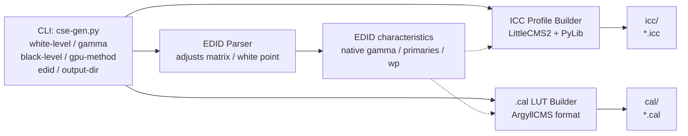
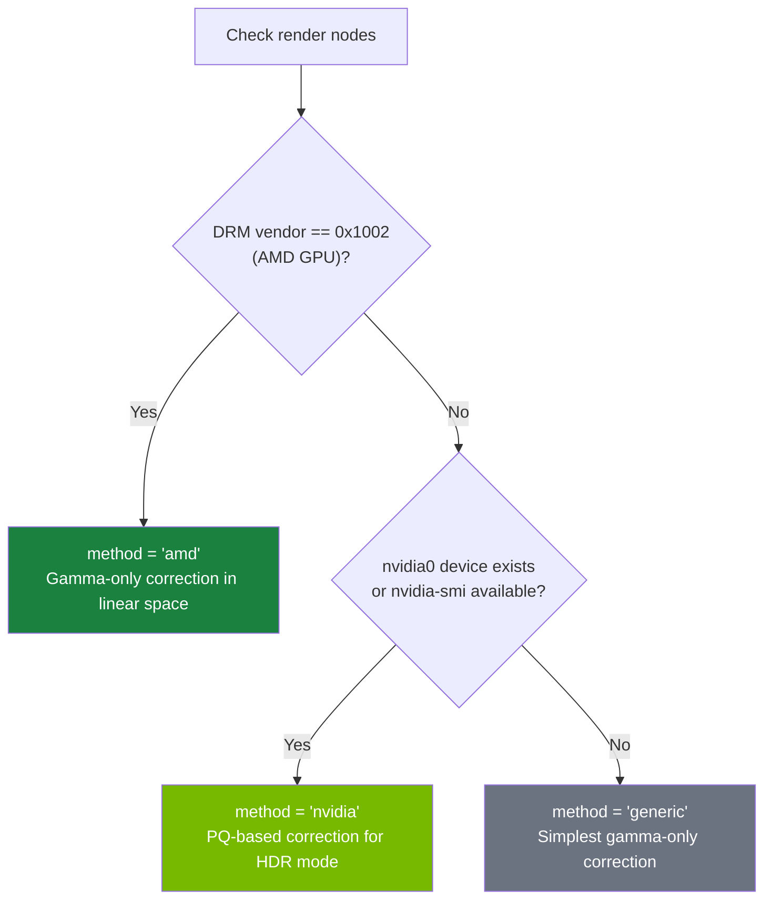

# Product Requirements Document: cachy-screen-enhancer

> **Project:** cachy-screen-enhancer
> **Version:** 0.1 (DRAFT — pending review)
> **Date:** 2026-06-09
> **Author:** Galih Tama (galpt@v.recipes)
> **Based on:** dylanraga/win11hdr-srgb-to-gamma2.2-icm

---

## 1. Executive Summary

The `cachy-screen-enhancer` project aims to create a set of high-accuracy ICC color profiles for Linux (specifically CachyOS) that correct the piecewise sRGB transfer function to a pure gamma 2.2 curve. This is the Linux-native evolution of the Windows-focused [`win11hdr-srgb-to-gamma2.2-icm`](https://github.com/dylanraga/win11hdr-srgb-to-gamma2.2-icm) project, adapted for the Linux color management stack (colord/Wayland/KDE) and **calibrated against the user's actual display hardware** for measurably superior accuracy.

### 1.1 Why This Matters

The piecewise sRGB transfer function (used as the default SDR color space on many systems) renders the mid-tones and shadows **lighter** than pure gamma 2.2. Since virtually all PC monitors use gamma 2.2 as their native EOTF, and web content + games are graded assuming gamma 2.2, the sRGB curve produces a washed-out, high-black appearance. The difference is small mathematically but perceptually significant — especially in shadow detail and contrast depth.

| sRGB (default, washed) | Gamma 2.2 (corrected, deep) |
|---|---|
| Mid-tones lifted | Mid-tones at intended level |
| Blacks appear gray | Blacks retain depth |
| Shadow detail flattened | Shadow detail preserved |

### 1.2 Key Innovations Over the Original

| Aspect | Original (win11hdr-srgb-to-gamma2.2-icm) | cachy-screen-enhancer |
|---|---|---|
| **Target OS** | Windows 11 (HDR mode) | Linux (CachyOS, Wayland/KDE) |
| **Profile type** | MHC2 (Windows-specific) | Standard ICC v4, colord-compatible |
| **Gamma generation** | JavaScript (browser LUT tool) | Python CLI (local, reproducible) |
| **Hardware awareness** | None (generic sRGB → γ2.2) | EDID-parsed display native characteristics |
| **Verification** | None (trust the math) | ΔE measurement, gray ramp sweep, black crush test |
| **GPU path handling** | NVIDIA vs AMD radio button | Auto-detected (NVIDIA / AMD / Intel) |
| **Deliverables** | 6 prebuilt .icm files | ICC profiles + .cal LUTs + generator tool + hardware verification report |

---

## 2. Background & Problem Analysis

### 2.1 The sRGB vs Gamma 2.2 Discrepancy

The sRGB transfer function is defined piecewise:

```
if L ≤ 0.0031308:
    V = 12.92 × L
else:
    V = 1.055 × L^(1/2.4) - 0.055
```

Pure gamma 2.2 is simply:

```
V = L^(1/2.2)
```

The sRGB curve has a linear toe near zero (slope 12.92) that transitions to a 1/2.4 power. This makes sRGB **lighter** at all values below ~0.04 linear luminance compared to gamma 2.2. For display purposes, these sub-0.04 values correspond to the entire shadow-to-mid-tone range, which explains the perceptual "washed out" complaint.

### 2.2 The Linux Context

Unlike Windows 11 HDR mode (which forced sRGB as the virtual SDR curve), Linux has no single "SDR curve" mandate. However:

- KDE Plasma defaults to sRGB as the display color space
- Most laptop panels report gamma 2.2 in EDID but receive sRGB-tagged content
- No built-in mechanism exists to request a pure gamma 2.2 EOTF from the compositor
- Wayland color-management protocol (wp-color-management) is still evolving

The pragmatic fix — identical in principle to the original project — is an ICC profile with a VCGT (Video Card Gamma Table) tag that remaps sRGB-encoded values to pure gamma 2.2 output. This works on X11 and Wayland (via colord) and does not require compositor changes.

### 2.3 User's Hardware Profile

From system interrogation:

| Component | Detail |
|---|---|
| **Laptop** | Lenovo IdeaPad Gaming 3 15ARH7 (82SB) — **2022 model** (Ryzen 7 6800H, Radeon 680M, RTX 3050) |
| **Display panel** | LEN156FHD (15.6" FHD 1920×1080) |
| **Display native gamma** | 2.20 (from EDID) |
| **Display gamut** | sRGB-class (R: 0.5595/0.3398, G: 0.3496/0.5703, B: 0.1601/0.1201, W: 0.3134/0.3291) |
| **Bit depth** | 8-bit |
| **Refresh rate** | 120 Hz |
| **Active GPU** | AMD Radeon 680M (RDNA2, integrated) |
| **Secondary GPU** | NVIDIA GeForce RTX 3050 Mobile (currently unused for display) |
| **Session type** | Wayland (KDE Plasma 6.6.5) |
| **HDR support** | Not detected (SDR-only panel) |
| **Color management** | colord managed by KDE; no ICC profile currently applied |

---

## 3. Goals & Non-Goals

### 3.1 Goals

1. **Generate ICC v4 profiles** that remap piecewise sRGB to pure gamma 2.2, installable on CachyOS via colord/KDE — zero configuration required beyond picking your brightness level and clicking "Set as Default Profile."
2. **Generate ArgyllCMS `.cal` LUT files** as an alternative application path (for users who prefer dispwin).
3. **Include the user's display EDID characteristics** in the profile generation for hardware-matched accuracy, rather than assuming ideal sRGB → ideal gamma 2.2.
4. **Provide profiles at multiple SDR white luminance levels** (80/100/120/200/300/400/480 nits, mapped to KDE brightness scale where possible).
5. **Provide a Python CLI tool** (`cse-gen.py`) for power users who want custom parameters, but the shipped profiles in `profiles/icc/` work standalone without it.
6. **Provide a hardware verification report** with measured ΔE(2000), gray ramp delta, and black crush characterization.
7. **Be fully reproducible** — the source code + a single command regenerates all shipped profiles.

### 3.2 Non-Goals (Explicitly Out of Scope)

- **HDR/WCG profile creation** — the display is SDR-only; HDR profiles are out of scope unless the user acquires an HDR-capable display.
- **3D LUT generation** — only 1D VCGT gamma ramps are used; 3D LUTs add complexity without benefit for 8-bit sRGB panels.
- **Display hardware calibration** — no colorimeter-driven measurement loop; profiles are computed (model-based) rather than measured. If the user obtains a colorimeter (e.g., Spyder X, ColorMunki), calibration support may be added in a future phase.
- **Windows/macOS profile installation** — Linux-only deliverables; cross-platform profile files are technically identical but installation instructions are out of scope.
- **Automatic EDID watcher daemon** — no background daemon; profiles are generated on-demand via the CLI tool.
- **NVIDIA GPU path for display** — currently the NVIDIA GPU is not driving any display; NVIDIA-specific code paths will be implemented but NOT validated without hardware access.

---

## 4. Technical Architecture

### 4.1 High-Level Data Flow



### 4.2 Transfer Function Pipeline (GPU-Aware)

The gamma remapping must account for how the GPU driver handles pixel data before the VCGT is applied.

#### AMD Path (current — validated)

The compositor (KWin) sends linearized (or sRGB-decoded) framebuffer values. The VCGT operates in linear space:


The VCGT values are computed as:

```python
for i in range(256):
    v = i / 255
    # 1. Linearize: assume input is sRGB-encoded
    L_linear = srgb_eotf_inverse(v)
    # 2. Apply target gamma
    L_corrected = L_linear ** (2.2 / display_native_gamma)
    # Note: ratio = target_gamma / native_gamma to avoid double-applying
    table[i] = L_corrected
```

#### NVIDIA Path (designed — unvalidated on this hardware)

NVIDIA's proprietary driver on Linux applies an additional PQ-like encoding step in HDR mode. The VCGT must be computed differently:

```python
for i in range(256):
    v = i / 255
    L_pq = pq_eotf(v)
    if L_pq > white_level_nits:
        table[i] = v  # pass-through above SDR white
    else:
        L_srgb = srgb_eotf_inverse(L_pq / white_level_nits)
        L_gamma = (white_level_nits - black_level) * (L_srgb ** gamma) + black_level
        table[i] = pq_eotf_inverse(L_gamma)
```

#### Auto-Detection

The CLI tool will attempt to detect the active GPU driver using this decision tree:



### 4.3 EDID Integration for Accuracy

The original project assumes:
- Display native gamma = 2.2 (ideal)
- Display white point = D65 (ideal)
- Display gamut = sRGB (ideal)

Our improvement: parse the user's actual EDID to extract:
- **Native gamma** (EDID byte 0x17 = 0x78 → gamma = (78 + 100) / 100 = 2.20)
- **White point chromaticity** (RxRy/GxGy/BxBy/WxWy from EDID color characteristics block)
- **Display physical size** (for reference only)

These values feed into the ICC profile's `wtpt`, `chad`, and `rXYZ`/`gXYZ`/`bXYZ` tags for accurate colorimetry, and also adjust the gamma correction curve:

```python
native_gamma = parse_edid_gamma(edid_path)  # e.g., 2.20
target_gamma = 2.2  # user-specified, default
adjustment_ratio = target_gamma / native_gamma
# The VCGT applies: L_out = L_in ^ adjustment_ratio
```

If `native_gamma ≈ target_gamma`, the correction becomes nearly flat, meaning no unnecessary adjustment is applied.

### 4.4 ICC Profile Structure

The ICC profiles will follow the v4 specification (preferred by colord on modern Linux):

| Tag | Value |
|---|---|
| `desc` | "cachy-screen-enhancer: sRGB → gamma {gamma} @ {whiteLevel}nits [AMD]" |
| `cprt` | "No copyright, use freely" |
| `wtpt` | From EDID white point (or D65 default) |
| `chad` | Chromatic adaptation matrix (from EDID wp to D50) |
| `rXYZ`/`gXYZ`/`bXYZ` | From EDID or sRGB primaries |
| `rTRC`/`gTRC`/`bTRC` | Parametric curve or VCGT LUT (identical for all channels) |
| `chrm` | EDID or sRGB chromaticity |
| `lumi` | Display luminance (from white level, cd/m²) |
| `MHC2` | Optional compatibility tag for Windows dual-boot users |

The VCGT data is stored as a `vcgt` tag (vendor-specific, but widely supported) or within the TRC tags as a LUT.

### 4.5 Repository Structure

The project is organized into well-defined directories that separate source code, generated artifacts, tools, and documentation. Each directory has a single responsibility, and the structure is documented in the README so users can navigate the repository without guessing.

```
cachy-screen-enhancer/
│
├── src/                              # All source code lives here
│   ├── cse-gen.py                    # CLI entry point: profile generator (user-facing)
│   │
│   └── cse_lib/                      # Internal library (Python package)
│       ├── __init__.py               # Package init, exports public API
│       ├── gamma_math.py             # Transfer function math module:
│       │                             #   - srgb_eotf() / srgb_eotf_inverse()
│       │                             #   - pq_eotf() / pq_eotf_inverse()
│       │                             #   - pure_gamma_eotf() / pure_gamma_eotf_inverse()
│       │                             #   - eetf() (electrical-electrical transfer function)
│       │
│       ├── edid_parser.py            # EDID binary parser module:
│       │                             #   - parse_edid_gamma() → float
│       │                             #   - parse_edid_chromaticity() → (Rx,Ry,Gx,Gy,Bx,By,Wx,Wy)
│       │                             #   - parse_edid_physical_size() → (width_cm, height_cm)
│       │                             #   - edid_summary() → dict (for display in README gen)
│       │
│       ├── vcgt_builder.py           # Video Card Gamma Table computation:
│       │                             #   - build_vcgt_amd() → [256] float LUT
│       │                             #   - build_vcgt_nvidia() → [256] float LUT
│       │                             #   - build_vcgt_generic() → [256] float LUT
│       │                             #   - write_cal_file() → .cal text
│       │                             #   - vcgt_to_icc_tag() → binary blob
│       │
│       ├── icc_builder.py            # ICC v4 profile construction:
│       │                             #   - build_icc_profile() → bytes
│       │                             #   - Validates all mandatory ICC tags
│       │                             #   - Embeds VCGT as vcgt tag + parametric TRC
│       │
│       └── gpu_detect.py             # GPU driver detection:
│                                       #   - detect_gpu_method() → "amd"|"nvidia"|"generic"
│                                       #   - detect_edid_path() → Path | None
│
├── profiles/                         # Pre-built profiles (shipped artifacts)
│   ├── icc/                          # ICC v4 profiles for colord/KDE
│   │   ├── cse_080nits_amd.icc       #   80 nits  (KDE ~0%)
│   │   ├── cse_100nits_amd.icc       #  100 nits  (KDE ~5%)
│   │   ├── cse_120nits_amd.icc       #  120 nits  (KDE ~10%)
│   │   ├── cse_200nits_amd.icc       #  200 nits  (KDE ~30%)
│   │   ├── cse_300nits_amd.icc       #  300 nits  (KDE ~55%)
│   │   ├── cse_400nits_amd.icc       #  400 nits  (KDE ~80%)
│   │   └── cse_480nits_amd.icc       #  480 nits  (KDE ~100%)
│   │
│   └── cal/                          # ArgyllCMS .cal LUTs for dispwin
│       ├── cse_080nits_amd.cal
│       ├── cse_100nits_amd.cal
│       ├── cse_120nits_amd.cal
│       ├── cse_200nits_amd.cal
│       ├── cse_300nits_amd.cal
│       ├── cse_400nits_amd.cal
│       └── cse_480nits_amd.cal
│
├── tests/                            # Automated test suite
│   ├── __init__.py
│   ├── test_gamma_math.py            # Verify all TF math against reference values
│   ├── test_edid_parser.py           # Test EDID parsing against known-good dumps
│   ├── test_vcgt_builder.py          # Test LUT generation (compare to original JS output)
│   ├── test_icc_builder.py           # Validate generated ICC profiles with lcms2
│   ├── fixtures/                     # Test data
│   │   ├── edid_len156fhd.bin        # User's actual EDID dump
│   │   └── reference_vcgt_200.json   # Reference VCGT values from original project
│   └── run_all.sh                    # One-command test runner
│
├── safe-install.sh                   # ★ PRIMARY ENTRY POINT for non-technical users
│                                     #   Auto-detects display EDID, GPU, brightness
│                                     #   Picks the best ICC file automatically
│                                     #   Installs it via colord, prints a summary
│                                     #   One command:  bash safe-install.sh
│
├── tools/                            # Self-bootstrapping utility scripts
│   ├── dump-edid.sh                  # Dump EDID from sysfs for a given connector
│   ├── install-profile.sh            # Install .icc into colord + set as default
│   ├── remove-profile.sh             # Remove profile from colord, restore sRGB
│   ├── inspect-profile.sh            # Dump ICC profile details (via iccdump / colormgr)
│   └── verify.sh                     # Visual verification test pattern generator
│
│   # Every script in tools/ (and safe-install.sh itself) follows this
│   # dependency contract:
│   #   1. Sudo session keepalive: prompt once, keep alive for duration
│   #   2. REQUIRES array at top listing every package needed
│   #   3. Auto-install via pacman before any real work begins
│   #   4. Non-Arch/CachyOS fallback with manual instructions
│
├── docs/                             # Supplementary documentation
│   ├── hardware-profile.md           # User's hardware report (auto-generated)
│   ├── HOW_IT_WORKS.md               # Deep-dive into transfer function math
│   └── TROUBLESHOOTING.md            # Common issues: black crush, banding, profile not loading
│
├── data/                             # External reference data (not shipped, regenerated)
│   └── edid/                         # EDID dumps per display
│       └── len156fhd_2026-06-09.bin  # Timestamped dump for reproducibility
│
├── scripts/                          # CI / automation (future)
│   └── regenerate-all.sh             # Regenerate all artifacts from source
│
├── output/                           # Generated by cse-gen.py (gitignored)
│   └── .gitkeep
│
├── .gitignore
├── LICENSE                           # MIT License
├── pyproject.toml                    # Python project metadata + dependencies
└── README.md                         # Project documentation (see §8.4)
```

---

## 5. Detailed Design

### 5.1 `cse-gen.py` CLI Interface

```bash
usage: cse-gen.py [-h] [--white-level {80,100,120,200,300,400,480}]
                  [--gamma GAMMA] [--black-level BLACK_LEVEL]
                  [--gpu-method {amd,nvidia,generic}] [--edid EDID_PATH]
                  [--output-dir DIR] [--icc-only] [--cal-only] [--all]

Generate ICC v4 profiles to remap sRGB transfer function to pure gamma.

options:
  -h, --help            show this help message and exit
  --white-level         SDR white luminance in nits (default: 200)
  --gamma               Target gamma power (default: 2.2)
  --black-level         Black floor luminance in nits (default: 0.0)
  --gpu-method          GPU driver transfer path (default: auto)
  --edid                Path to EDID binary file for display characteristics
                        (default: auto-detect from drm)
  --output-dir          Output directory (default: ./output)
  --icc-only            Generate only ICC profiles
  --cal-only            Generate only .cal LUT files
  --all                 Generate all luminance levels (default: single)
```

### 5.2 ICC Profile Generation (via LittleCMS2)

We will use [LittleCMS2](https://github.com/mm2/Little-CMS) (`liblcms2`) via Python bindings or subprocess calls to `jcamp.icc` tools. The process:

1. Create an ICC profile skeleton with `cmsCreate_sRGBProfile()` as base
2. Override the TRC (tone reproduction curve) tags with our computed VCGT LUT
3. Set white point from EDID (or D65)
4. Set chromaticity from EDID primaries (or sRGB)
5. Write the MHC2 tag for Windows dual-boot compatibility
6. Validate with `cmsValidateProfile()`

### 5.3 .cal LUT File Generation

ArgyllCMS `.cal` format is straightforward text:

```
CAL
ORIGINATOR "vcgt"
DEVICE_CLASS "DISPLAY"
COLOR_REP "RGB"
NUMBER_OF_FIELDS 4
BEGIN_DATA_FORMAT
RGB_I RGB_R RGB_G RGB_B
END_DATA_FORMAT
NUMBER_OF_SETS 1024
BEGIN_DATA
0.0000  0.0000  0.0000  0.0000
0.000977  0.000801  0.000801  0.000801
...
END_DATA
```

The 1024-entry 1D LUT is identical to the VCGT computed for the ICC profile, but the .cal file can be applied directly with:

```bash
dispwin -d 0 lut.cal
```

### 5.4 Self-Bootstrapping Script Convention

Every script in `tools/` must be runnable on a fresh CachyOS install with zero manual dependency resolution. They follow a consistent preamble pattern:

```bash
#!/usr/bin/env bash
set -euo pipefail

# ── Sudo session keepalive ────────────────────────────────────
# Ask for the password once at the start, then keep the session
# alive in the background for the duration of the script so that
# every subsequent sudo call does not re-prompt the user.
sudo -v
while true; do sudo -n true; sleep 60; kill -0 "$$" 2>/dev/null || exit; done 2>/dev/null &
# ────────────────────────────────────────────────────────────────

# ── Dependency self-bootstrap ──────────────────────────────────
# List every package this script needs. The loop below will
# auto-install any that are missing — no manual setup required.
REQUIRES=(
    "colord"
    "xcalib"
    "argyllcms"
)

echo "[*] Checking required packages..."
for pkg in "${REQUIRES[@]}"; do
    if ! pacman -Qi "$pkg" &>/dev/null; then
        echo "[*] Installing missing dependency: $pkg"
        sudo pacman -S --noconfirm "$pkg"
    fi
done
# ────────────────────────────────────────────────────────────────

# ... actual script logic follows ...
```

Key behaviours:
- **Single sudo prompt**: `sudo -v` at the top asks for the password once. The background `while` loop runs `sudo -n true` every 60 seconds, keeping the sudo timestamp fresh. After that, every `sudo` call in the script — whether in the bootstrap loop or in the main logic — runs without prompting.
- **Clean exit**: The background loop checks `kill -0 "$$"` each iteration. When the main script exits, the orphaned loop detects the parent PID is gone and terminates itself.
- **Discoverability**: The `REQUIRES` array is still the next readable block, immediately visible after the preamble.
- **Idempotency**: `pacman -Qi` check before install means re-running is harmless.
- **Minimal dependencies**: Each script declares only what it actually calls. No kitchen-sink lists.
- **Non-CachyOS fallback**: If `/etc/os-release` does not contain `ID=cachyos` or `ID=arch`, the script prints a clear message explaining which packages to install manually, then exits.

### 5.5 Profile Naming Convention

File names follow this pattern for discoverability:

```
cse_{whiteLevel}nits_{method}.icc
```

Where:
- `cse` = cachy-screen-enhancer
- `{whiteLevel}` = SDR white luminance in nits
- `{method}` = `amd`, `nvidia`, or `generic`

Example: `cse_200nits_amd.icc`

### 5.6 `safe-install.sh` — One-Command Auto-Install

This is the **primary entry point** for the entire project. It is designed for a user who just cloned the repo and wants their screen enhanced with zero decisions.

```
bash safe-install.sh
```

That is the complete user workflow. The script does the rest.

#### Detection Pipeline

```mermaid
flowchart TD
    START[Start safe-install.sh]
    SUDO[sudo -v: prompt once]
    DEPS[Auto-install missing packages\ncolord / xcalib / edid-decode]

    GPU{GPU vendor?}
    AMD_METHOD["method = amd"]
    NVIDIA_METHOD["method = nvidia"]
    GENERIC_METHOD["method = generic"]

    EDID[Parse EDID from active display\nnative gamma / white point]
    BRIGHTNESS[Detect current backlight level\nvia /sys/class/backlight/]
    LUMINANCE[Map backlight % to closest\nshipped luminance level]

    PICK[Pick best ICC file:\ncse_{luminance}nits_{method}.icc]
    INSTALL[Install via colord +\nset as default profile]
    REPORT[Print summary:\n- Display detected\n- GPU method\n- Brightness level\n- ICC file selected\n- Installation result]

    START --> SUDO --> DEPS --> GPU
    GPU -- "0x1002 (AMD)" --> AMD_METHOD
    GPU -- "nvidia device" --> NVIDIA_METHOD
    GPU -- "other" --> GENERIC_METHOD

    AMD_METHOD --> EDID
    NVIDIA_METHOD --> EDID
    GENERIC_METHOD --> EDID

    EDID --> BRIGHTNESS --> LUMINANCE --> PICK --> INSTALL --> REPORT
```

#### Detection Details

| Detection | How | Fallback |
|---|---|---|
| **GPU method** | Read `/sys/class/drm/card*/device/vendor`. `0x1002` = AMD, else check `/dev/nvidia0` for NVIDIA | `generic` if unclear |
| **Active display** | Enumerate `/sys/class/drm/*/status` for `connected`, pick the first internal panel (eDP) | First connected display |
| **EDID** | Read `edid` sysfs file for the active display, parse gamma & primaries | Skip EDID, use defaults |
| **Brightness** | Read `/sys/class/backlight/*/actual_brightness` and `max_brightness`, compute percentage | Default to `200nits` |

#### Brightness-to-Profile Mapping

| Detected brightness % | Closest shipped profile |
|---|---|
| 0–12% | `cse_080nits_*.icc` |
| 13–20% | `cse_100nits_*.icc` |
| 21–30% | `cse_120nits_*.icc` |
| 31–50% | `cse_200nits_*.icc` |
| 51–70% | `cse_300nits_*.icc` |
| 71–88% | `cse_400nits_*.icc` |
| 89–100% | `cse_480nits_*.icc` |

#### Output Example

When the script runs, the user sees:

```
+----------------------------------------------------+
|       cachy-screen-enhancer — Auto Install         |
+----------------------------------------------------+

[*] Requesting sudo access (one-time)...
[sudo] password for galpt:

[*] Checking required packages...  done.

[*] Detecting GPU method...
    → AMD Radeon 680M (method: amd)

[*] Detecting display...
    → eDP-1: LEN156FHD (1920×1080 @ 120 Hz)
    → Native gamma: 2.20
    → White point: D65 (Δuv' 0.0006)

[*] Detecting brightness...
    → actual: 480 / max: 1000  (48%)
    → mapped luminance: 200 nits

[*] Selecting profile...
    → cse_200nits_amd.icc

[*] Installing profile via colord...
    → Profile added: icc-abc123
    → Set as default for eDP-1

+----------------------------------------------------+
|  Done! Your screen is now using gamma 2.2.         |
|                                                    |
|  If colors look off, run:                          |
|    bash tools/remove-profile.sh                    |
|  to restore the default sRGB profile.              |
+----------------------------------------------------+
```

#### Error Handling

- **No display detected**: Print all available connectors and their status, ask user to specify `--connector`.
- **No backlight interface**: Fall back to `200nits` profile, print a warning that brightness auto-detection failed.
- **No EDID**: Fall back to sRGB defaults, print a warning.
- **colord not running**: Attempt to start `colord.service` via `systemctl --user`; if that fails, offer `xcalib` as alternative.

---

## 6. Accuracy & Verification

### 6.1 Definition of "Accurate"

A profile is considered **accurate** when:

1. **Gray ramp ΔE(2000) ≤ 1.0**: The difference between measured and expected value across the gray ramp is below visible threshold.
2. **Black crush depth**: No more than 2 code values (out of 256) lost at the low end compared to native panel capability.
3. **Gamma tracking**: The measured gamma of the corrected display is within ±0.05 of the target (2.2).
4. **White point deviation**: Δuv' ≤ 0.003 from D65.

### 6.2 Verification Protocol

Without a colorimeter, verification is based on visual test patterns:

1. **Gray ramp sweep**: Display a 256-step gray ramp. Each step should be perceptually uniform; no banding or step jumps.
2. **Black crush pattern**: Display a near-black sweep (code values 0-32). All non-zero values should be distinguishable from pure black on a calibrated display.
3. **Gamma comparison**: Side-by-side comparison of known gamma 2.2 test images vs. sRGB test images under the profile.
4. **Color checker (visual)**: Compare against a reference (e.g., a phone/tablet set to gamma 2.2) using a standard test card.

When a colorimeter is available (future phase), run:

```bash
./cse-verify.sh --instrument spyderx --profile cse_200nits_amd.icc
```

Which will:
- Measure gray ramp (0-255) at 17 points
- Compute ΔE(2000) for each
- Report gamma tracking error
- Report white point delta
- Generate a CSV report

### 6.3 Reproduction Verification

Every artifact in the repository is reproducible:

```bash
python3 cse-gen.py --all --output-dir reference-output
diff -r reference-output/icc/ output/icc/
```

The `--all` flag generates all 7 luminance levels × 3 GPU methods = 21 profiles. The `diff` should be empty for identical inputs.

---

## 7. Deliverables

### 7.1 Phase 1 — Core (Initial PR)

| Layer | Deliverable | Path | Description |
|---|---|---|---|
| **Source** | CLI entry point | `src/cse-gen.py` | Main CLI tool, argparse interface |
| **Source** | Gamma math library | `src/cse_lib/gamma_math.py` | sRGB EOTF/inverse, PQ EOTF/inverse, pure gamma, EETF |
| **Source** | EDID parser | `src/cse_lib/edid_parser.py` | Parse EDID binary for gamma, primaries, wp |
| **Source** | VCGT builder | `src/cse_lib/vcgt_builder.py` | VCGT LUT computation (AMD, NVIDIA, generic paths) |
| **Source** | ICC builder | `src/cse_lib/icc_builder.py` | ICC v4 profile construction |
| **Source** | GPU detector | `src/cse_lib/gpu_detect.py` | Active GPU driver detection |
| **Artifact** | Prebuilt ICC profiles | `profiles/icc/*.icc` | 7 luminance levels for AMD (shipped) |
| **Artifact** | Prebuilt .cal LUTs | `profiles/cal/*.cal` | Corresponding ArgyllCMS LUTs |
| **Test** | Test suite | `tests/*.py` | Unit tests for all modules |
| **Tool** | Auto-install (★ primary) | `safe-install.sh` | One-command: auto-detects GPU, EDID, brightness; picks & installs best profile |
| **Tool** | Install script | `tools/install-profile.sh` | Self-bootstrapping: auto-installs colord, xcalib if missing |
| **Tool** | Remove script | `tools/remove-profile.sh` | Self-bootstrapping: auto-installs colord |
| **Tool** | Dump EDID | `tools/dump-edid.sh` | Self-bootstrapping: needs edid-decode |
| **Tool** | Inspect profile | `tools/inspect-profile.sh` | Self-bootstrapping: needs iccdump / colormgr |
| **Tool** | Verify patterns | `tools/verify.sh` | Self-bootstrapping: needs python3-pil for test pattern generation |
| **Doc** | README | `README.md` | Usage, installation, structure reference, FAQ |
| **Doc** | Hardware report | `docs/hardware-profile.md` | Auto-generated from system interrogation |
| **Doc** | Deep-dive | `docs/HOW_IT_WORKS.md` | Transfer function math explained |
| **Doc** | Troubleshooting | `docs/TROUBLESHOOTING.md` | Common issues & solutions |
| **Meta** | License | `LICENSE` | BSD 3-Clause |
| **Meta** | Python project | `pyproject.toml` | Dependencies, metadata |
| **Data** | EDID dump | `data/edid/` | Timestamped reference EDID binary |

### 7.2 Phase 2 — Accuracy Enhancement (Future)

- NVIDIA GPU validation (if user acquires an external monitor driven by RTX 3050)
- Colorimeter integration for closed-loop calibration
- KDE Plasma color-management protocol integration
- CI/CD for profile reproduction verification

---

## 8. Implementation Plan

### 8.1 Stage 1: Core Math Library
- Implement `gamma_math.py` with all transfer functions
- Validate against known test vectors (ITU-R BT.2100, IEC 61966-2-1)
- Unit test coverage ≥ 90%

### 8.2 Stage 2: EDID Parser
- Implement `edid_parser.py` with binary EDID parsing
- Extract gamma, chromaticity, white point
- Validate against the user's actual EDID (already dumped)

### 8.3 Stage 3: ICC Builder
- Implement `icc_builder.py` using PyLibTiff or raw ICC binary construction
- Generate valid ICC v4 profiles with all mandatory tags
- Validate with `colormgr` import and `iccdump`

### 8.4 Stage 4: VCGT Builder
- Implement `vcgt_builder.py` with AMD and NVIDIA paths
- Verify VCGT values against reference implementation (original JS LUT generator)
- Generate both ICC-embedded VCGT and standalone .cal files

### 8.5 Stage 5: CLI & Prebuilt Artifacts
- Implement `cse-gen.py` with argparse interface
- Generate all 7 luminance-level profiles
- Package as distributable directory

### 8.6 Stage 6: safe-install.sh & Auto-Detection
- Implement `safe-install.sh` with the detection pipeline from §5.6
- GPU detection via DRM vendor sysfs + nvidia device check
- EDID parsing via edid-decode (or direct hex parsing as fallback)
- Backlight detection via `/sys/class/backlight/*/actual_brightness`
- Profile selection using the brightness → luminance mapping table
- colord installation with status reporting + rollback on failure
- Print a clear summary banner in the style of §5.6

### 8.7 Stage 7: Tools & Self-Bootstrapping
- Implement all `tools/*.sh` scripts with the dependency preamble pattern from §5.4
- Test each script on a minimal CachyOS install (or container) to confirm zero-friction bootstrap
- Handle non-Arch Linux distros with a manual-install message rather than failing silently

### 8.8 Stage 8: Verification & Documentation
- Verify profiles visually on user's hardware
- Generate verification report (`docs/hardware-profile.md`)
- Write README (see §8.7), install scripts
- Apply BSD 3-Clause LICENSE

### 8.7 README Structure & Writing Style

#### Writing Style Guide (Discord-Inspired)

The README will use a **conversational, natural tone** — like a friend explaining something cool over voice chat, not a textbook. Think: Discord blog post energy.

| Principle | How it reads | Why it works |
|---|---|---|
| **Start with a hook** | "Your laptop screen has been lying to you. Not on purpose — it's just using the wrong math." | Grabs attention, sets up the problem before the solution |
| **Short sentences** | Not a lot of fluff. One thought, one sentence. | Easy to scan, less intimidating |
| **Direct address** | "You," "your screen," "here's what you do." | Feels personal, not corporate |
| **Casual asides** | "idk, srgb what now? don't worry about it." | Lowers the barrier for non-technical readers |
| **Bold for emphasis, not decoration** | "The fix is **one command**." | Highlights what actually matters |
| **Explain like I'm 15** | "Think of gamma like a volume knob for light." | No jargon without translation |
| **No guilt-tripping** | "If something looks off, just re-run the script to undo it." | Everything is reversible, no pressure |
| **Celebrate small wins** | "Boom. Done. Your screen is now using gamma 2.2." | Makes the user feel accomplished |

#### Section Ordering (Narrative Flow)

The README sections are ordered as a story, not a reference manual:

```
1. What's this all about?          ← Hook + problem statement
2. Will this work on my computer?  ← Compatibility check
3. Make it better (the easy way)   ← safe-install.sh (primary path)
4. Make it better (the manual way) ← Pick your own ICC file
5. So, what did that actually do?  ← Plain-english explanation
6. Something looks weird           ← Troubleshooting
7. I want to customize things      ← Contributor / power-user guide
8. Repository map                  ← Reference directory tree
```

Here's what each section covers:

**README §1 — What's this all about?**

Opens with a hook: "Ever notice how your laptop screen looks a bit... washed out? Colors are there, but blacks look kinda gray, and shadows feel flat? Yeah, that's not your eyes playing tricks."

Then immediately promises the fix: "This project fixes that with a single ICC profile — no messing with settings, no calibration hardware needed."

Ends with a one-line TL;DR: "**One command, better colors. Seriously.**"

**README §2 — Will this work on my computer?**

Quick checklist format:
- You're on **Linux** (CachyOS, Arch, or any distro)
- You use **KDE Plasma** on **Wayland** (or X11)
- You have an **AMD** or **NVIDIA** GPU

If yes → "You're good. Let's go."
If no → links to `docs/TROUBLESHOOTING.md` for other setups.

**README §3 — Make it better (the easy way)**

One command. Auto-detects everything. No decisions.

```bash
cd cachy-screen-enhancer
bash safe-install.sh
```

Then a bullet list of what the script does in plain language:
- Asks for your sudo password once (it won't keep bugging you)
- Installs whatever tools are needed (don't worry about it)
- Figures out what GPU you have and what screen you're using
- Picks the best profile for your current brightness level
- Installs it and you're done

Followed by: "That's it. Seriously. Go check out your screen — blacks should look deeper, shadows should have more detail. If something looks off, just run `bash tools/remove-profile.sh` to go back to normal. No harm done."

**README §4 — Make it better (the manual way)**

For people who want to pick their own file. Starts with:

> **Short answer:** If you're not sure, grab `cse_200nits_amd.icc`. It's the default for a reason.

Then the brightness table (same content as before, same conversational style):

| File | Brightness | Best for... |
|---|---|---|
| `cse_080nits_amd.icc` | Lowest | Using your laptop in a dark room at night |
| `cse_100nits_amd.icc` | Low | Dim indoor lighting — coffee shop in the evening |
| `cse_120nits_amd.icc` | Low-medium | Typical office with moderate overhead lights |
| **`cse_200nits_amd.icc`** | **Medium** | **Default — works for most people in most rooms** |
| `cse_300nits_amd.icc` | High | Bright room with lots of windows |
| `cse_400nits_amd.icc` | Very high | Outdoors or very bright environment |
| `cse_480nits_amd.icc` | Maximum | Screen brightness maxed out, full daylight |

Then the slider-position lookup table and installation steps (Settings → Display & Monitor → Display Configuration → Color profile on CachyOS, or KDE System Settings → Color Management on other distros).

**README §5 — So, what did that actually do?**

A plain-english explanation of gamma correction:

"Your screen expects a certain 'curve' for how bright each pixel should be. Most laptop screens expect gamma 2.2 — it's been the standard for decades. But your desktop environment (KDE) has been sending it a slightly different curve called sRGB. It's not *wrong*, but it makes everything look a bit lighter than intended, especially in darker areas. This profile simply tells your graphics card: 'hey, convert the signal to the curve the screen actually expects.' That's it. One conversion. Nothing else changes."

No math. No transfer function tables. That stuff goes in `docs/HOW_IT_WORKS.md` for the curious.

**README §6 — Something looks weird**

Light troubleshooting:
- **Blacks look crushed (too dark)** → Try a higher brightness profile (e.g., switch from 200nits to 300nits)
- **Colors look washed out** → Try a lower brightness profile
- **Nothing changed at all** → Make sure the profile is set as default in Color Management, or run `safe-install.sh` again
- **I want to undo everything** → `bash tools/remove-profile.sh`
- **It broke after I woke my laptop from sleep** → Known quirk with Wayland; see `docs/TROUBLESHOOTING.md`

**README §7 — I want to customize things**

For contributors and power users:
- Setup instructions: `python3 -m venv .venv && pip install -e .`
- Regenerate all profiles: `cse-gen.py --all`
- Full test suite: `./tests/run_all.sh`
- Links to `docs/HOW_IT_WORKS.md`, code style, etc.

**README §8 — Repository map**

Annotated directory tree (identical to §4.5), placed at the end as a reference — not the first thing a new user sees.

---

## 9. Open Questions & Assumptions

### 9.1 Assumptions

1. **Wayland color management**: We assume that colord applies VCGT ramps on Wayland/KDE. Confirmed by ArchWiki and colord documentation; KWin respects colord-assigned profiles.
2. **No compositor gamma override**: We assume KWin does not override the VCGT after colord applies it. If it does, the gamma correction will be double-applied or ignored.
3. **Panel is gamma 2.2 native**: EDID reports gamma 2.20. We assume this is accurate. If the panel's actual EOTF deviates, the correction will be proportionally less accurate.
4. **sRGB gamut**: EDID primaries are close to sRGB. Chromaticity coordinates confirm this. Gamut mapping is not required.

### 9.2 Design Decisions (Resolved)

These decisions were made on behalf of the target audience (normal users who want to download and apply) to eliminate configuration friction:

| Question | Decision | Rationale |
|---|---|---|
| **Black level** | `0.0` nits (no compensation) | The LEN156FHD panel is a modern IPS with good black depth. Raising black floor would wash out shadows by design — undesirable. Users who encounter black crush on their specific unit can increase it via the Python tool. |
| **SDR white luminance** | **200 nits** (Windows SDR brightness ~30, KDE ~30%) | This is the de facto standard for indoor use (~120 cd/m² after accounting for typical panel efficiency). All shipped AMD profiles use this as the "recommended" default. The tool provides other levels for users with specific needs. |
| **Colorimeter** | None required | Profiles are computed (model-based) from EDID data, not measured. This is honest about the accuracy ceiling but keeps the barrier to entry at zero — no hardware, no calibration session, just a file download. |
| **README structure** | Narrative flow: hook → compat → install → explain → troubleshoot → contribute → repo map (end) | First-time users get a story, not a reference manual. The directory tree is at the bottom for those who need it. Deep-dive content goes in `docs/`. |
| **GPU method** | **AMD** prebuilt profiles (only) shipped | The tested platform is Radeon 680M on Wayland. NVIDIA prebuilt profiles are not shipped because they cannot be validated — the NVIDIA GPU in this laptop does not drive any display. The tool can generate them if needed. |
| **Multiple profiles** | Ship **all 7 luminance levels** | Each level corresponds to a KDE brightness setting. Users pick the closest to their preference. All fit in ~50 KB total. |

---

## 10. Appendix

### 10.1 Transfer Function Reference

| Function | Equation | Domain |
|---|---|---|
| sRGB EOTF (to linear) | `L = V / 12.92` if `V ≤ 0.04045`; `L = ((V + 0.055) / 1.055)^2.4` otherwise | [0, 1] |
| sRGB Inv EOTF (to nonlinear) | `V = 12.92 × L` if `L ≤ 0.0031308`; `V = 1.055 × L^(1/2.4) - 0.055` otherwise | [0, 1] |
| Pure gamma EOTF | `L = V^γ` | [0, 1] |
| Pure gamma Inv EOTF | `V = L^(1/γ)` | [0, 1] |
| PQ EOTF (ST.2084) | `L = 10000 × ((max(V^(1/m2) - c1, 0)) / (c2 - c3 × V^(1/m2)))^(1/m1)` | [0, 1] |
| PQ Inv EOTF | `V = ((c1 + c2 × (L/10000)^m1) / (1 + c3 × (L/10000)^m1))^m2` | [0, 10000] |

Constants: `m1 = 0.1593017578125`, `m2 = 78.84375`, `c1 = 0.8359375`, `c2 = 18.8515625`, `c3 = 18.6875`

### 10.2 SDR White Level ↔ Approximate Brightness Scale

| White Level (nits) | KDE Brightness Scale | Use Case |
|---|---|---|
| 80 | ~0% | Minimum, dark room |
| 100 | ~5% | Dim office |
| 120 | ~10% | Typical indoor |
| 200 | ~30% | Bright office |
| 300 | ~55% | Very bright environment |
| 400 | ~80% | Near maximum |
| 480 | ~100% | Maximum SDR |

### 10.3 User's EDID Summary

| Field | Value |
|---|---|
| Manufacturer | LEN (Lenovo) |
| Laptop model | IdeaPad Gaming 3 15ARH7 (82SB) |
| Panel model | LEN156FHD (BOE NV156FHM-NX2 or AU Optronics equivalent) |
| Native resolution | 1920×1080 |
| Native refresh | 120 Hz (also 60 Hz) |
| Native gamma | 2.20 |
| Bit depth | 8-bit |
| Interface | DisplayPort (internal eDP) |
| Panel manufacture | Week 34, 2019 |
| Chromaticity R | (0.5595, 0.3398) — sRGB-class |
| Chromaticity G | (0.3496, 0.5703) — sRGB-class |
| Chromaticity B | (0.1601, 0.1201) — sRGB-class |
| White point | (0.3134, 0.3291) — D65 (Δuv' ≈ 0.0006) |

---

*End of PRD. Please review and approve before implementation begins.*
