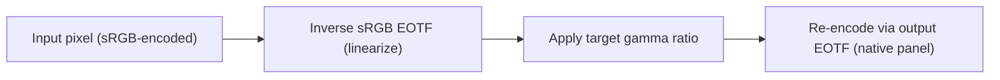

# How It Works

> The technical deep-dive behind cachy-screen-enhancer. This is for the curious —
> you don't need to read any of this to use the profiles.

---

## The problem: sRGB vs gamma 2.2

Most computer displays expect a **pure gamma 2.2** transfer function. That's been the de facto standard for decades — it matches how CRT phosphors responded to voltage, and it stuck around for LCDs and OLEDs.

The sRGB transfer function (IEC 61966-2-1) is similar, but with a **linear toe** near zero:

```
sRGB:     V ≤ 0.04045 → L = V / 12.92
          V > 0.04045 → L = ((V + 0.055) / 1.055) ^ 2.4

Gamma 2.2:  L = V ^ 2.2
```

The linear toe in sRGB makes values below ~0.04 linear luminance **lighter** than pure gamma 2.2. Perceptually, that means shadows and near-blacks are lifted — the "washed out" look.



The correction is a ratio: `gamma_target / gamma_native`. Since the LEN156FHD panel reports gamma 2.20 in EDID and we target 2.2, the ratio is ~1.0 — meaning the correction is subtle. For panels with different native gammas, the adjustment scales accordingly.

## The fix: ICC profiles with VCGT

An **ICC profile** is a standardized file format that describes how a device handles color. One optional tag is the **Video Card Gamma Table** (`vcgt`) — a lookup table that the graphics driver applies to every pixel before sending it to the display.

By embedding the correct remapping LUT in the `vcgt` tag, we tell the GPU: "for every input value, output this corrected value instead." The display never knows the difference — it just receives pixels that match its expected gamma.

## ICC profile structure

Every generated profile is a valid **ICC v4.2** (`mntr` device class, `RGB ` color space, `XYZ ` PCS) with these tags:

| Tag | Purpose | Content |
|---|---|---|
| `desc` | Description | "cachy-screen-enhancer: sRGB → gamma 2.2 @ 200nits [AMD]" |
| `cprt` | Copyright | BSD 3-Clause notice |
| `wtpt` | White point | D65 (or EDID-reported white point) adapted to D50 |
| `chad` | Chromatic adaptation | Bradford D65→D50 matrix |
| `rXYZ`/`gXYZ`/`bXYZ` | Colorant matrix | RGB → XYZ primaries (from EDID or sRGB defaults) |
| `rTRC`/`gTRC`/`bTRC` | Tone reproduction curve | Parametric gamma curve |
| `chrm` | Chromaticity | Display color primaries |
| `lumi` | Luminance | White level in cd/m² |
| `vcgt` | Video Card Gamma Table | 256×3×16-bit LUT (the actual correction) |

### VCGT tag format

```
Offset  Content
0-3     'vcgt' signature
4-7     Reserved (0)
8-11    Number of channels (3 for RGB)
12-15   Bits per entry (16)
16-19   Number of entries (256)
20+     LUT data: 3 channels × 256 entries × 2 bytes each = 1536 bytes
```

Each entry: `round(lut[i] × 65535)` as unsigned 16-bit big-endian.

## GPU code paths

### AMD path (shipped profiles)

The AMD GPU driver (via `amdgpu` kernel module + Mesa) applies VCGT in linear space. The correction LUT is:

```python
def build_vcgt_amd(white_level, gamma, native_gamma):
    for i in range(256):
        v = i / 255
        L_linear = srgb_eotf_inverse(v)  # linearize sRGB
        L_corrected = L_linear ** (gamma / native_gamma)
        table[i] = L_corrected
```

The `gamma / native_gamma` ratio means if native gamma equals target gamma, the correction is essentially flat.

### NVIDIA path (code complete, unvalidated)

NVIDIA's proprietary driver applies a PQ (Perceptual Quantizer, ST.2084) encoding layer in HDR mode. The correction must account for this:

```python
def build_vcgt_nvidia(white_level, gamma, black_level):
    for i in range(256):
        v = i / 255
        L_pq = pq_eotf(v)  # PQ EOTF → nits
        if L_pq > white_level:
            table[i] = v  # pass-through above SDR white
        else:
            L_srgb = srgb_eotf_inverse(L_pq / white_level)
            L_gamma = (white_level - black_level) * (L_srgb ** gamma) + black_level
            table[i] = pq_eotf_inverse(L_gamma)
```

### Generic path (fallback)

Simple gamma-only correction for unknown GPU configurations:

```python
def build_vcgt_generic(white_level, gamma, black_level):
    for i in range(256):
        v = i / 255
        L = v ** gamma
        table[i] = L
```

## EDID integration

The **EDID** (Extended Display Identification Data) is a 128-byte binary blob that every monitor exposes to the graphics card. It contains:

- **Native gamma** (byte 0x17): `gamma = (byte + 100) / 100` — for the LEN156FHD: `0x78 → (120+100)/100 = 2.20`
- **Chromaticity coordinates** (bytes 0x19–0x23): 10-bit per channel RGBAW xy values
- **Physical size** (bytes 0x15–0x16): width and height in centimeters

The profile generator reads these values and embeds them in the ICC tags, making the profile specifically matched to your display rather than using generic sRGB assumptions.

## Chromatic adaptation (Bradford)

Display white points are typically D65 (0.3127, 0.3290), but ICC profiles store white points relative to **D50** (0.9642, 1.0, 0.8249). The **Bradford chromatic adaptation transform** converts between these:

1. Convert source (display) XYZ to LMS cone responses
2. Scale by the ratio of D50/display LMS values
3. Convert back to XYZ

This ensures the white point tag (`wtpt`) and colorant matrix tags (`rXYZ`/`gXYZ`/`bXYZ`) are correctly referenced to the ICC profile connection space.

## .cal LUT format

ArgyllCMS uses a text-based `.cal` format for 1D lookup tables:

```
CAL
ORIGINATOR "vcgt"
DEVICE_CLASS "DISPLAY"
COLOR_REP "RGB"
NUMBER_OF_FIELDS 4
BEGIN_DATA_FORMAT
RGB_I RGB_R RGB_G RGB_B
END_DATA_FORMAT
NUMBER_OF_SETS 1024
BEGIN_DATA
0.0000  0.0000  0.0000  0.0000
0.000977  0.000801  0.000801  0.000801
...
END_DATA
```

The 1024-entry LUT is linearly interpolated from the 256-entry VCGT. Apply it with:

```bash
dispwin -d 0 profile.cal
```

## Color science references

- **IEC 61966-2-1:1999** — sRGB color space specification
- **SMPTE ST 2084:2014** — Perceptual Quantizer (HDR)
- **ITU-R BT.2100-2** — Image parameter values for HDR TV
- **ISO 15076-1:2010** — ICC colour management architecture
- **ICC.1:2010** — ICC profile specification (v4.2.0.0)
